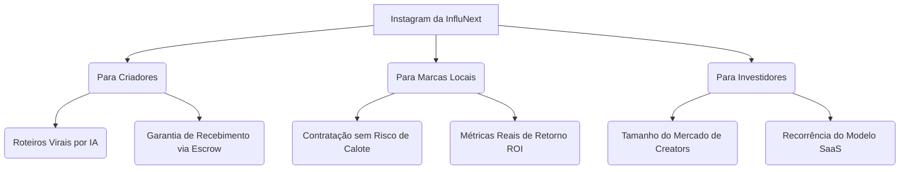

# 📊 InfluNext - Diretrizes de Posicionamento, Instagram & Pitch para Investidores

Este documento reúne o material de apoio para a estruturação do perfil oficial da **InfluNext** no Instagram, um plano de captação de investidores por meio de conteúdo estratégico e uma auditoria de melhorias na Landing Page para aumentar a conversão de usuários e o interesse de parceiros financeiros.

---

## 🎨 1. Logotipo Oficial (Instagram & Brand Assets)

Geramos uma versão de alta fidelidade e resolução do logotipo da InfluNext. Ele segue o padrão estético **Dark Premium** do aplicativo:
- **Ícone de Velocímetro (Speedometer)**: Representando aceleração de carreira, performance e crescimento do InfluScore.
- **Gradiente Violet-to-Pink**: Transmite inovação, dinamismo e modernidade.
- **Fundo Sólido Escuro**: Ideal para o avatar do Instagram e materiais de branding.

> [!TIP]
> Você pode baixar a imagem acima diretamente do diretório do projeto para usá-la como imagem de perfil no Instagram.

---

## 📱 2. Estratégia de Conteúdo e Posicionamento no Instagram

Para chamar a atenção de **investidores** e ao mesmo tempo atrair **criadores de conteúdo**, o Instagram da InfluNext deve se posicionar como um ecossistema de infraestrutura de negócios, e não como uma agência comum.

### 📐 Estrutura da Bio (Foco em Conversão)
A Bio precisa deixar claro em 3 segundos o que a plataforma faz e o problema bilionário que ela resolve.

*   **Nome**: InfluNext | Plataforma de Publicidade
*   **Bio**:
    🚀 Infraestrutura financeira e inteligência de carreira para criadores.
    🔒 Negócios e entregas seguras entre marcas e criadores.
    👇 Eleve o seu nível:
*   **Link**: `influnext.com.br`

### 💡 Pilares de Conteúdo (Content Pillars)

1.  **Pilar 1: A Dor do Calote e da Permuta (Atração de Creators)**
    *   *Formato*: Reels curtos com ganchos de impacto.
    *   *Exemplo*: "Por que você ainda trabalha por hambúrguer? Como a InfluNext garante que seu cachê seja depositado antes mesmo de você abrir a câmera."
2.  **Pilar 2: A Segurança para o Comércio Local (Atração de Marcas)**
    *   *Formato*: Carrossel educativo.
    *   *Exemplo*: "Como contratar influenciadores locais sem medo de não entregarem o post. Conheça o sistema de Micro-Escrow da InfluNext."
3.  **Pilar 3: Números do Mercado & Modelo SaaS (Atração de Investidores)**
    *   *Formato*: Gráficos limpos e dados de mercado.
    *   *Exemplo*: "O mercado de Creator Economy vai movimentar R$ 250B até 2027. Como a InfluNext monetiza na intermediação e na assinatura dos criadores."

---

## 📝 3. Pitch One-Pager (Para enviar para Investidores)

Quando um investidor entrar em contato ou você prospectar ativamente, envie esta mensagem resumida/pitch sheet:

> ### 🚀 InfluNext - O Uber da Creator Economy Local
>
> **O Problema:**
> O mercado de micro-influenciadores locais é altamente fragmentado e informal. 90% das negociações ocorrem via WhatsApp sem contrato formal, resultando em calotes para os criadores e falta de entrega (ou métricas infladas) para as marcas locais.
>
> **A Solução:**
> A **InfluNext** é uma plataforma que une marcas locais a criadores locais sob duas garantias tecnológicas:
> 1.  **Escrow Seguro**: A marca deposita o valor em juízo na plataforma antes de iniciar a campanha. O saldo só é liberado para o influenciador após o link da publicação ser auditado e aprovado.
> 2.  **Mentor de IA (Vincenzo/Kowalski)**: Um copiloto de negócios que analisa as métricas do criador, organiza sua rotina e gera roteiros de vendas personalizados para o comércio dele.
>
> **O Modelo de Negócios (Como ganhamos dinheiro):**
> *   **Modelo Híbrido**: Taxa de comissão transacional sobre cada campanha intermediada (de 5% a 15%).
>   *   **SaaS Recorrente**: Assinatura mensal dos criadores (Plano Pro: R$ 49/mês; Plano Master: R$ 149/mês) para reduzir as taxas de comissão transacionais e liberar recursos avançados do Mentor de IA.
>
> **Diferenciais Competitivos:**
> *   Foco no interior e comércio regional (um mercado intocado pelas grandes agências).
>   *   Auditoria automatizada de entregáveis usando Inteligência Artificial.

---

## 🔍 4. Auditoria e Pontos de Melhoria na Landing Page

Para que a Landing Page converta mais visitas em cadastros e desperte a curiosidade de investidores:

### ⚠️ Pontos Críticos Atuais & Soluções

| Elemento Atual | Problema Identificado | Solução Recomendada |
| :--- | :--- | :--- |
| **Hero (Primeira dobra)** | Embora seja muito premium, o texto ainda é muito longo e conceitual para quem lê em dispositivos móveis. | Deixar o gancho mais curto e direto: *"Profissionalize sua rotina como criador, garanta seu pagamento em conta protegida e multiplique suas publis com IA."* |
| **Visualização do Painel** | Os mockups estáticos em código mostram o painel, mas não explicam a simplicidade do fluxo da plataforma. | Criar um pequeno diagrama visual animado na página ilustrando o fluxo: **Depósito da Marca ➔ Produção do Criador ➔ Auditoria da IA ➔ Liberação do PIX.** |
| **Falta de Prova Social Simulada** | Investidores procuram tração. Sem ver pessoas ativas, a página parece fria. | Adicionar um pequeno widget de atividade recente (ex: *"Marcas parceiras garantiram R$ 14.500 em escrow nesta semana"* ou *"Último saque PIX realizado por criador em Sorocaba/SP há 12 minutos"*). Isso desperta urgência e curiosidade. |
| **Claridade do Modelo SaaS** | A landing page atual foca muito nos benefícios do usuário, mas um investidor não vê a tabela de preços ou o valor das assinaturas na página principal. | Adicionar uma seção minimalista de **Planos & Preços** na Landing Page detalhando as taxas (15% Free, 10% Pro, 5% Master) para provar a viabilidade econômica e o modelo de monetização recorrente à primeira vista. |

---

> [!NOTE]
> Este documento estratégico serve como base para direcionar a comunicação visual e textual da plataforma. Recomendo utilizá-lo como um roteiro de conteúdo para os primeiros posts e destaques do Instagram da InfluNext.
