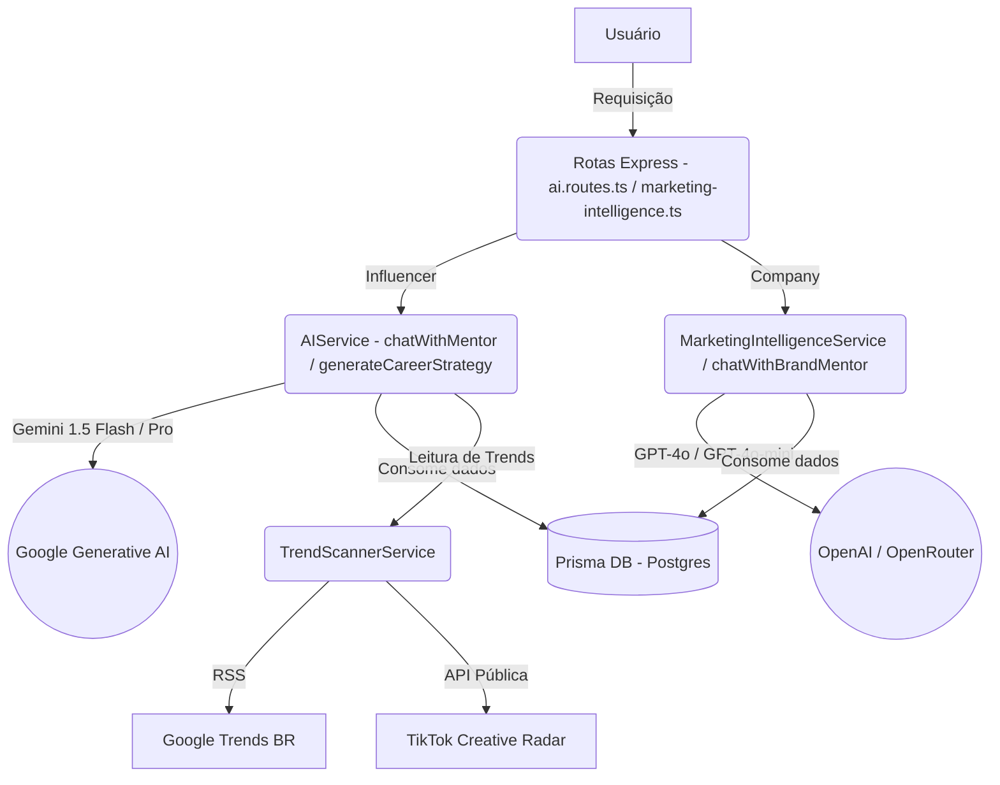

# ✦ Guia de Arquitetura e Engenharia de IA — InfluNext

Este documento detalha o funcionamento, as regras de negócio, as personas, a infraestrutura de dados e a integração de Inteligência Artificial no ecossistema da **InfluNext**. Ele serve como guia definitivo para desenvolvimento, testes e escala das nossas soluções cognitivas.

---

## 🗺️ Visão Geral da Arquitetura de IA

A inteligência da InfluNext é dividida em dois grandes núcleos: **IA para Criadores de Conteúdo (Influenciadores)** e **IA para Empresas (Brands)**. Toda a integração é construída sobre o SDK oficial da Google Generative AI (usando modelos Gemini) e APIs complementares de IA/LLM (como OpenAI e OpenRouter).



---

## 📂 Localização dos Arquivos de IA no Projeto

Para qualquer modificação ou expansão das lógicas de IA, consulte os seguintes caminhos:

*   **Lógica de Serviços de IA**:
    *   [ai.service.ts](file:///d:/Influnext/src/services/ai.service.ts): Contém o mentor virtual de criadores (Vincenzo/Valentina), o auditor de entregas e o parser de linguagem natural para o calendário.
    *   [marketing-intelligence.service.ts](file:///d:/Influnext/src/services/marketing-intelligence.service.ts): Contém a execução das análises de mercado para empresas e integração com OpenAI.
    *   [trend-scanner.service.ts](file:///d:/Influnext/src/services/trend-scanner.service.ts): Varredura em tempo real do Google Trends e do TikTok Creative Center.
*   **Rotas e Controllers**:
    *   [ai.routes.ts](file:///d:/Influnext/src/routes/ai.routes.ts): Endpoints de geração de estratégias semanais, chat e briefings de campanha.
    *   [marketing-intelligence.controller.ts](file:///d:/Influnext/src/controllers/marketing-intelligence.controller.ts): Limites de crédito por plano, validações de requisição e histórico das análises.
*   **Modelo de Dados**:
    *   [schema.prisma](file:///d:/Influnext/prisma/schema.prisma): Definições de tabelas como `InfluencerProfile` (`aiInterview`), `MarketingAnalysis`, `TrendReference` (TrendVault) e `AIAnalysis`.

---

## 🤖 1. IA para Criadores de Conteúdo (Influencers)

A IA para criadores tem como principal objetivo atuar como um **Estrategista-Chefe de Monetização e Mentor de Negócios**. Ela é moldada sob a filosofia **"Dark Premium"** (lucro sobre vaidade; recebidos não pagam boletos).

### 👥 Personas Disponíveis

Dependendo dos dados fornecidos pelo criador durante a entrevista (`aiInterview`), a IA assume dinamicamente duas personas principais de mentoria:
1.  **VINCENZO** (Mentor Masculino): Ativado por padrão ou se o influenciador se identificar com o gênero masculino (incluindo tratamento direto a contas de teste como o usuário *Alexsandro*).
2.  **VALENTINA** (Mentora Feminina): Ativada quando o influenciador se identifica com o gênero feminino no cadastro da entrevista. Ajusta os pronomes de tratamento para "sócia", "preparada", "campeã", etc.

### 🧠 Princípios de Raciocínio & Prompts

Abaixo estão os pilares de funcionamento que governam as tomadas de decisão da IA ao gerar rotinas e conversar no Chat:

#### A. Tom de Voz e Foco de Caixa (Dark Premium)
*   **Filosofia**: Direta, sênior, brutalmente honesta e focada em retorno financeiro (ROI).
*   **Objetivo**: Transformar o criador em uma empresa independente ("uma banda que toca sozinha").
*   **Prompt System (Resumo do `ai.service.ts`)**:
    > *"Você é o/a [Vincenzo/Valentina], Estrategista-Chefe de Monetização e mentor(a) de negócios do INFLUNEXT. Seu objetivo é lucro, geração de receita e escala profissional do criador de conteúdo. Seja direto, focado em metas reais de caixa e fale de igual para igual como um sócio. Lembre-se: recebidos não pagam boletos."*

#### B. Suporte Completo a Contas Dark/Faceless
*   **Lógica**: Se no JSON da entrevista do criador (`influencer.aiInterview`) for identificado o tipo de conteúdo como `'dark'` ou `'faceless'`, a IA entra em modo "Conta Dark".
*   **Diretriz**:
    > *"O criador gerencia uma CONTA DARK/FACELESS (sem aparecer). Suas recomendações, ideias de vídeos ou roteiros NÃO devem incluir gravar o próprio rosto, aparecer na câmera, vestuário, maquiagem ou carisma físico. Em vez disso, foque 100% em técnicas de roteiro com ganchos de retenção nos primeiros 3 segundos, edição dinâmica, narração em áudio (voiceover/IA), escolha de trilhas sonoras virais, uso de banco de vídeos e design de som."*

#### C. Cobrança e Motivação Baseada no Escrow
*   **Lógica**: A IA verifica contratos ativos do influenciador que possuam valores retidos na garantia segura da InfluNext (Escrow).
*   **Diretriz**:
    > *"O criador possui o total de X em garantia (Escrow) segura na InfluNext. Use estes dados financeiros para cobrar a execução das tarefas. Lembre o criador do valor pendente no Escrow que será liberado assim que ele postar a entrega. Diga a ele que o dinheiro já está garantido na plataforma e depende da ação dele para cair na carteira."*

#### D. Memória de Performance Anti-Repetição
*   **Lógica**: O sistema recupera as últimas 10 tarefas do banco de dados que possuem um `performanceMultiplier`.
*   **Regra**:
    *   **Ideias que falharam (`performanceMultiplier < 1.0`)**: Proibido sugerir tarefas semelhantes. A IA é orientada a ser honesta: *"Sócio, esse tema anterior não rendeu. O algoritmo está frio para isso, vou traçar algo novo para nós."*
    *   **Ideias de sucesso (`performanceMultiplier > 1.2`)**: A IA escala e inova sobre o que funcionou.

#### E. Gestão de Carreira e Conexão Humana (stories espontâneos)
*   **Lógica**: Para que o criador não vire apenas um "painel de anúncios ambulante", a IA equilibra a monetização com o pilar de conexão.
*   **Regra**:
    > *"Você DEVE incluir nas tarefas sugeridas (suggestedTasks) a recomendação de postar stories aleatórios e espontâneos (ex: bastidores do dia a dia, rotina sem intenção comercial direta, ou momentos reais sem roteiro) para engajar e humanizar a marca pessoal do criador, lembrando-o de que nem tudo deve ser publis/vendas."*

#### F. Regra de Confidencialidade (Anti-Reveal)
*   **Regra**: A IA nunca revela que é um modelo de linguagem ou bot. Se questionada, responde com firmeza executiva:
    > *"Eu sou o/a Vincenzo/Valentina, seu/sua estrategista de carreira na InfluNext. O resto é detalhe de engenharia. O que importa é o nosso plano de escala. Vamos focar no que dá lucro."*

---

## 🏢 2. IA para Empresas (Brands)

O motor voltado para empresas atua no posicionamento estratégico e proteção de caixa. Ele está integrado em duas principais frentes: o mentor virtual corporativo e os relatórios inteligentes de marketing.

### 🦾 Persona Brand Mentor: VEKTOR
*   **Função**: Estrategista-Chefe de Branding, Posicionamento de Marca e Otimização de ROI de Campanhas de Marketing de Influência.
*   **Tom de Voz**: Analítico, corporativo de alto nível, focado em performance, dados auditados e escala regional.

### 🧠 Princípios de Raciocínio & Prompts

#### A. Consistência e Escalabilidade (Scalability Rule)
*   **Regra**: O mentor orienta a marca a não gastar o orçamento inteiro em um único "mega-influenciador".
*   **Diretriz**:
    > *"Não é necessário gastar fortunas ou milhões de reais de uma vez. O importante é o crescimento escalonável e a consistência no posicionamento do produto. Mais vale realizar campanhas menores e constantes de testes de ganchos do que gastar todo o orçamento em um único influenciador grande."*

#### B. Defesa do Cachê do Criador com Base em Dados (Anti-Bargaining)
*   **Regra**: Se a marca pechinchar taxas ou cachês, o Vektor justifica o valor com base em métricas auditadas, combatendo a desvalorização profissional.
*   **Diretriz**:
    > *"Pechinchar preço atrai entregas fracas. O InfluNext garante que cada real pago é respaldado por dados reais auditados de engajamento (InfluScore, retenção), eliminando seguidores falsos. Justifique o cachê com base no retorno e no ticket médio do produto do cliente."*

#### C. Criação Completa de Campanha
*   **Regra**: Ao sugerir campanhas, o Vektor não dá dicas genéricas; ele constrói ideias de ganchos (hooks) visuais de 3 segundos adequados ao produto da marca, mapeia concorrentes e traça o tipo de criador adequado no marketplace.

---

### 📊 3. Relatórios Inteligentes de Marketing (Consultoria 9-Em-1)

A empresa pode executar 9 tipos de análises profundas por meio do `MarketingIntelligenceService`. O nível do plano da empresa determina o modelo (planos FREE/PRO usam `gpt-4o-mini`, planos MASTER/ENTERPRISE usam `gpt-4o`).

| Código | Nome da Análise | Descrição Técnica do Prompt |
| :--- | :--- | :--- |
| **A1** | Diagnóstico de Posicionamento | Avalia diferenciação de mercado, proposta de valor, mensagem principal e alinhamento com público. |
| **A2** | Estratégia de Campanha de Influência | Mapeia o tipo ideal de criador, nicho-alvo, formato de conteúdo recomendado, KPIs e budget allocation. |
| **A3** | Análise de Crescimento e Escala | Identifica canais de expansão, frequência ideal de campanhas, sazonalidade e projeções de budget. |
| **A4** | Estratégia de Retenção de Audiência | Foca em aumentar engajamento de longo prazo, consistência, fidelização e co-criação com influenciadores. |
| **A5** | Diagnóstico de Precificação e ROI | Analisa ticket médio, CPC/CPM esperados e alinhamento com a taxa operacional de 15% de Escrow do app. |
| **O1** | Resposta Competitiva | Analisa concorrentes diretos do segmento e oportunidades de diferenciação por campanhas de influência. |
| **O2** | Auditoria de Presença Digital | Avalia a consistência da marca nas redes sociais e propõe "quick wins" de otimização de imagem. |
| **O3** | Mapeamento de Nichos de Criadores | Sugere os clusters de influenciadores mais compatíveis com o ticket médio e mercado consumidor do produto. |
| **O4** | Plano com Nano & Microinfluenciadores | Desenha uma operação de alto volume com pequenos criadores (1K-50K), contatos e métricas de conversão. |

#### Limites de Uso Mensal (Subscription Tiers):
Os créditos são renovados mensalmente de acordo com as regras de cobrança definidas no controller:
*   **FREE**: 1 análise por mês.
*   **PRO**: 5 análises por mês.
*   **MASTER**: 15 análises por mês.
*   **ENTERPRISE**: Créditos ilimitados.

---

## 🛠️ 4. Utilitários Inteligentes e Serviços de Apoio

### 📡 Trend Scanner Service (`trend-scanner.service.ts`)
Para garantir dados em tempo real sem estourar custos, o scanner realiza buscas híbridas com cache de **1 hora**:
1.  **Google Trends RSS**: Varre o feed público de trending topics do Brasil (`geo=BR`) buscando notícias e termos em ascensão.
2.  **TikTok Creative Radar**: Acessa a API pública do Creative Radar para coletar os sons mais populares da semana no Brasil.
3.  **Fallback de Qualidade**: Se as requisições falharem, recupera uma lista curada de tópicos e áudios virais atualizados dinamicamente pelo sistema.

### 📅 Parser de Comando de Linguagem Natural (`parseNaturalCommand`)
O calendário da aplicação aceita inserções rápidas de tarefas via texto ou áudio transcrito.
*   **Como funciona**: A IA lê a string livre e extrai a intenção (`CREATE_TASK` ou `DELETE_TASK`), limpando verbos comuns ("agendar", "colocar") e computando datas relativas ("amanhã", "hoje", "dia 12") em formato ISO válido.
*   **Fallback Local**: Caso a chave Gemini falhe ou esteja ausente, o serviço conta com uma engine secundária baseada em **Regex complexas** para garantir que a inserção de datas e compromissos continue funcionando offline.

### 🔍 Auditor Automático de Entregáveis (`auditDeliverableLink`)
Evita fraudes e otimiza o trabalho da equipe de suporte auditando links de entrega de contratos em segundos.
*   **Estrutura de Entrada**: Recebe a URL da publicação (`proofUrl`), tipo de entregável, briefing original do contrato e roteiro sugerido pela IA.
*   **Processamento**:
    1.  Valida se o link corresponde ao domínio do Instagram ou do TikTok.
    2.  Verifica menções obrigatórias da marca baseadas no briefing e roteiro.
    3.  Retorna aprovação, pontuação de confiança (`confidenceScore`) de 0 a 100 e feedback em português do Brasil explicando as razões técnicas.

---

## 💾 5. Mapeamento de Banco de Dados (Prisma)

A tabela abaixo descreve as principais estruturas de banco e seus papéis no fluxo de IA:

```prisma
model InfluencerProfile {
  // ...
  aiInterview     String?   // JSON com respostas da entrevista (gênero, sonhos, frequências de posts)
  influScore      Int       @default(0) // Métrica proprietária de engajamento
  aiAnalyses      AIAnalysis[]
  trendVault      TrendReference[] // Banco local de referências expirável em 20 dias
}

model MarketingAnalysis {
  id           String   @id @default(uuid())
  companyId    String
  analysisType String   // Identificadores de A1-O4
  inputs       String   // Parâmetros do formulário salvos em string JSON
  output       String   // Relatório estratégico gerado pela IA em Markdown
  planTier     String   // Categoria do plano ativo no momento
  createdAt    DateTime @default(now())
}

model TrendReference {
  id           String   @id @default(uuid())
  influencerId String
  title        String
  videoUrl     String
  thumbnail    String?
  niche        String
  expiresAt    DateTime // Ciclo automático de expiração (criação + 20 dias)
}
```

---

## 📈 Benefícios Entregues aos Nossos Clientes

### Para Criadores de Conteúdo (Influencers)
*   **Direção Sem Bloqueio Criativo**: Recebem 3 tarefas diárias práticas com scripts, roteiros, trilhas e referências de vídeo prontas com base em tendências reais do dia.
*   **Monetização Acelerada**: O mentor Vincenzo/Valentina empurra o criador a prospectar marcas usando mensagens de Pitch prontas e cobrando a execução das tarefas para liberação de saldos em garantia (Escrow).
*   **Humanização de Perfil**: A IA planeja momentos de stories cotidianos sem foco comercial para elevar as taxas de engajamento do perfil de forma orgânica.

### Para Empresas (Brands)
*   **Garantia de ROI em Campanhas**: A IA Vektor garante que a marca estruture briefings eficientes com ganchos visuais voltados a vendas de acordo com o ticket médio da empresa.
*   **Auditoria de Fraude Automática**: Publicações de influenciadores são analisadas por IA contra briefings em tempo real, economizando horas de auditoria manual e garantindo a correta liberação de escrow.
*   **Inteligência de Mercado Gratuita a Premium**: Relatórios completos em Markdown oferecem planos de ativação imediatos sem a necessidade de consultorias de marketing tradicionais de alto custo.
