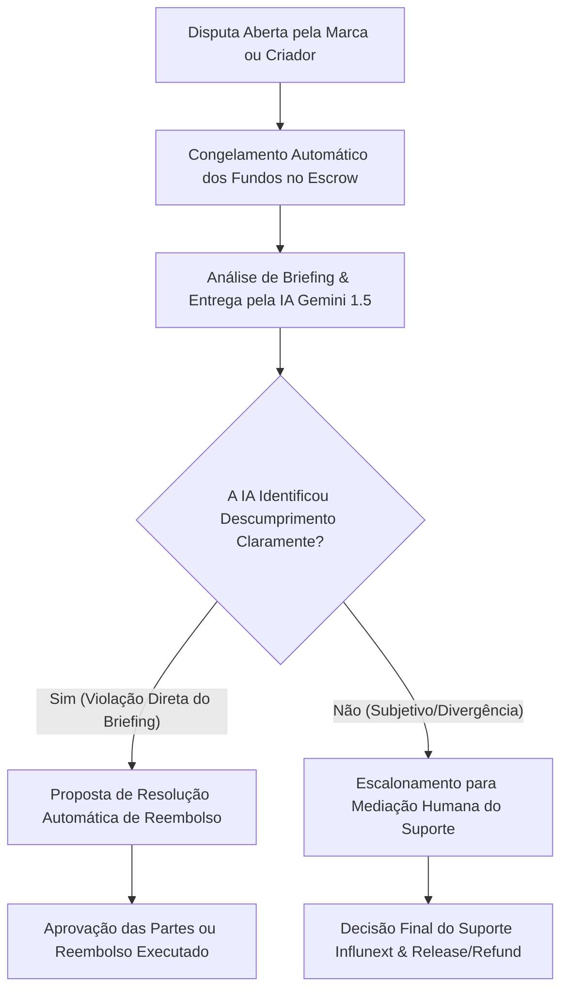

# 🛡️ Influnext — Manual Completo de Arquitetura Anti-Fraude, Segurança e Integridade de Plataforma (2026)

Este documento estabelece o **Manual Oficial de Prevenção à Fraude e Integridade de Negócios** da **Influnext**. Ele detalha os mecanismos técnicos, os algoritmos de auditoria, as regras de negócio e os protocolos jurídicos desenhados para proteger Marcas e Criadores de Conteúdo contra fraudes financeiras, manipulação de dados, entregas falsas e bypass de plataforma.

---

## 📋 Sumário Executivo

1. [Visão Geral & Princípios Fundamentais](#1-visão-geral--princípios-fundamentais)
2. [Módulo 1: Anti-Bypass & Proteção Contra Negociação Externa](#2-módulo-1-anti-bypass--proteção-contra-negociação-externa)
3. [Módulo 2: Anti-Fraude de Pagamentos, Escrow & Chargebacks](#3-módulo-2-anti-fraude-de-pagamentos-escrow--chargebacks)
4. [Módulo 3: Anti-Fraude na Entrega de Conteúdo & Provas de Trabalho](#4-módulo-3-anti-fraude-na-entrega-de-conteúdo--provas-de-trabalho)
5. [Módulo 4: Auditabilidade Criptográfica de Métricas & Detecção de Bots](#5-módulo-4-auditabilidade-criptográfica-de-métricas--detecção-de-bots)
6. [Módulo 5: Protocolo de Gestão de Disputas & Mediação de IA](#6-módulo-5-protocolo-de-gestão-de-disputas--mediação-de-ia)
7. [Módulo 6: Matriz de Risco, Penalidades & Registro de Consentimento](#7-módulo-6-matriz-de-risco-penalidades--registro-de-consentimento)

---

## 1. Visão Geral & Princípios Fundamentais

A **Influnext** opera como uma infraestrutura financeira e de inteligência para marketing de influência. Para garantir a viabilidade do negócio e a confiança dos usuários, o sistema foi construído sob quatro pilares inegociáveis:

- **Custódia Garantida (Escrow-First)**: Nenhum influenciador trabalha sem a garantia de que o dinheiro já está retido pela plataforma, e nenhuma marca paga sem a garantia de devolução integral caso o trabalho não seja entregue.
- **Veracidade Auditada via API**: Impede o uso de prints de Photoshop ou métricas infladas artificialmente.
- **Transparência Algorítmica**: Toda ação contratual gera um hash imutável `SHA-256` registrado no banco de dados.
- **Zero Tolerância a Desvios**: Ferramentas ativas de monitoramento impedem a migração de conversas para canais não protegidos antes da efetivação do pagamento.

---

## 2. Módulo 1: Anti-Bypass & Proteção Contra Negociação Externa

### 2.1. O Problema da Evasão (*Disintermediation*)
Em plataformas de marketplace, contratantes e prestadores de serviço frequentemente tentam negociar por fora para evitar taxas. Na Influnext, negociar por fora expõe a marca a calotes (pagamento antecipado sem entrega) e expõe o criador a calotes (publicação feita sem recebimento do cachê).

### 2.2. Algoritmo Sanitizador de Mensagens e Briefings (Regex Anti-Bypass Engine)
Todas as entradas de texto em briefings públicos, propostas diretas e chat de negociação são processadas antes de serem persisitidas ou exibidas.

#### Padrões Rastreados pelo Sanitizador:
1. **Telefones e WhatsApp**:
   - Expressões como `(XX) 9XXXX-XXXX`, `+55`, `119...`, `chama no zap`, `meu whats`, `me add no wpp`.
2. **Endereços de E-mail**:
   - Padrões regex de e-mail (`[a-zA-Z0-9._%+-]+@[a-zA-Z0-9.-]+\.[a-zA-Z]{2,}`).
3. **Dados de Pagamento Externo**:
   - Chaves Pix (CPF/CNPJ formatados ou numéricos, e-mails de chave Pix, chaves aleatórias UUIDv4).
   - Contas bancárias (Agência e Conta corrente/poupança).
4. **Handles e Redes Externas**:
   - Mentions de Telegram (`@username`), links de redes externas, convites de Discord, menções a *"DM do Insta"*.

#### Ação do Sanitizador:
- O texto detectado é substituído pela máscara: `[CONTEÚDO BLOQUEADO POR SEGURANÇA 🛡️]`.
- Uma notificação educativa é renderizada na tela do usuário explicando os riscos de fechar por fora.

### 2.3. Blindagem de Dados no Mídia Kit Público (`/p/[handle]`)
- O e-mail real, telefone e dados de contato pessoal do criador de conteúdo **nunca são expostos na API pública** (`getPublicProfile`).
- A única via de contato e contratação disponível para marcas visitantes é o botão público **Instant Escrow Checkout**.

---

## 3. Módulo 2: Anti-Fraude de Pagamentos, Escrow & Chargebacks

### 3.1. Proteção Contra Cartões Clonados e Fraudes Financeiras
A integração com o gateway **Stripe** utiliza múltiplos níveis de segurança:

1. **Autenticação 3D Secure 2.0 (3DS2)**: Exigida em transações de cartão para validação biométrica/OTP junto ao banco emissor.
2. **Stripe Radar AI**: Bloqueia automaticamente compras originadas de IPs de risco, proxies maliciosos ou cartões sinalizados em listas globais de fraude.
3. **Limites Dinâmicos de Checkout Concorrente**: Marcas no plano gratuito só podem manter até 3 contratos ativos simultaneamente em status de pendência, prevenindo testes em massa com cartões roubados.

### 3.2. Custódia em Escrow e Proteção Contra Idempotência Dupla
- O valor da contratação (Cachê do Criador + 7% Taxa de Proteção Escrow) é retido em uma conta de custódia isolada.
- **Prevenção de Ataques de Replay / Release Duplo**:
  - Toda liberação de pagamento (`releasePayment`) exige uma chave de idempotência única (`Idempotency-Key` no header HTTP).
  - O banco de dados valida via transação atômica (`prisma.$transaction`) se o campo `releaseTxId` já foi preenchido. Se sim, a requisição é rejeitada com código `409 Conflict`.

### 3.3. Anti-Self-Dealing (Prevenção de Auto-Contratação)
Para impedir que usuários simulem contratações falsas para lavagem de dinheiro ou manipulação de score:
- O sistema bloqueia contratações onde o e-mail da marca é idêntico ao e-mail do criador.
- Transações com mesmo IP de origem entre marca e influenciador são sinalizadas para auditoria de fraude.

---

## 4. Módulo 3: Anti-Fraude na Entrega de Conteúdo & Provas de Trabalho

### 4.1. Verificação Automática de Links de Entregáveis
Ao enviar a prova de trabalho (link do Reels, TikTok ou Story), o influenciador é submetido às seguintes verificações:

1. **Validação de Domínio Oficial**:
   - Apenas URLs pertencentes aos domínios oficiais (`instagram.com`, `tiktok.com`, `youtube.com`) são aceitas como `proofUrl`.
2. **Inspeção de Status HTTP**:
   - O worker de background efetua uma requisição de HEAD no link para garantir que o post está **público e acessível** (retornando status `200 OK`). Links para contas privadas ou posts deletados/arquivados são rejeitados instantaneamente.

### 4.2. Algoritmo Anti-Exclusão Prematura (30-Day Retention Tracking)
Uma das fraudes mais comuns é o criador postar o conteúdo, receber o dinheiro do Escrow e apagar o post 24 horas depois.

#### Como a Influnext Previne:
- Após a liberação do pagamento, a tarefa entra em um ciclo de monitoramento automatizado durante **30 dias**.
- O worker de background checa periodicamente se a publicação continua ativa.
- **Se o post for deletado ou alterado para privado antes de 30 dias**:
  1. O status da entrega é alterado para `VIOLATED`.
  2. O **InfluScore** do criador sofre uma penalização severa (perda de até 300 pontos).
  3. Os fundos futuros da carteira do criador podem ser bloqueados para ressarcimento da marca afetada.

---

## 5. Módulo 4: Auditabilidade Criptográfica de Métricas & Detecção de Bots

### 5.1. Eliminação de Screenshots Editados no Photoshop
Tradicionalmente, influenciadores enviam prints do estúdio do Instagram que podem ser facilmente adulterados com ferramentas de edição de imagem.

#### Solução Influnext (Selo SHA-256 Verified):
- A coleta de seguidores, engajamento, alcance das últimas 30 dias e média de views é feita **diretamente via Graph API oficial do Instagram/TikTok** utilizando tokens de acesso OAuth 2.0.
- No momento da coleta, os servidores da Influnext calculam o hash SHA-256 dos dados brutos:
  $$\text{integrityHash} = \text{SHA-256}(\text{influencerId} + \text{followers} + \text{reach} + \text{timestamp})$$
- Esse hash é gravado no modelo `MetricSnapshot` no banco de dados e exibido no Mídia Kit Público ([/p/[handle]](file:///a:/influnext-api-main/influnext-api-main/web/src/app/p/%5Bhandle%5D/page.tsx)).
- Marcas podem clicar no selo **API Oficial (SHA-256 Verified)** para conferir a chave auditada.

### 5.2. Detecção de Engajamento Falso e Fazendas de Bots (Bot Farms)
O motor de inteligência de marketing da Influnext calcula a **Eficiência vs Mercado (ROI Impact)** comparando métricas cruzadas:

- **Alerta de Anomalia de Engajamento**: Se a taxa de engajamento for superior a 15% com alcance desproporcionalmente baixo, o algoritmo sinaliza suspeita de compra de curtidas.
- **Fator de Ponderação no InfluScore**: Criadores com padrão de crescimento orgânico consistente recebem classificação `GOLD` ou `PLATINUM`. Criadores com picos atípicos não auditados ficam travados na categoria `BRONZE`.

---

## 6. Módulo 5: Protocolo de Gestão de Disputas & Mediação de IA

Quando ocorre desacordo entre a Marca e o Influenciador sobre a qualidade ou conformidade do material entregue, o contrato entra em status `DISPUTE`.

### Regras do Processo de Disputa:
1. **Congelamento Imediato**: Os recursos financeiros permanecem 100% seguros na conta de custódia da Stripe. Nenhuma das partes pode sacar o valor durante a disputa.
2. **Análise de Conformidade por IA**: O motor da IA compara o texto do `briefing` aprovado com o link da publicação entregue e o `aiScript` original.
3. **Decisão Final**: Caso seja comprovado que o criador não seguiu as diretrizes obrigatórias estipuladas no contrato, o valor é estornado integralmente para a marca.

---

## 7. Módulo 6: Matriz de Risco, Penalidades & Registro de Consentimento

### 7.1. Matriz de Sanções Automáticas

| Nível de Violação | Descrição da Infração | Ação Técnica Automática |
| :--- | :--- | :--- |
| **Nível 1 (Leve)** | Tentativa de envio de WhatsApp/E-mail em chat ou briefing. | Sanitização imediata do texto com aviso educativo. |
| **Nível 2 (Média)** | Reincidência de bypass ou atraso sem justificativa na entrega. | Perda do Selo SHA-256 Verified por 30 dias + Queda de InfluScore. |
| **Nível 3 (Grave)** | Exclusão prévia de post pago ou tentativa de golpe financeiro. | Congelamento de saldo em Escrow + Suspensão definitiva da conta. |

### 7.2. Registro Imutável de Assinatura Eletrônica (Consent Log)
Toda aceitação de contrato gera um registro de consentimento assinado digitalmente:

$$\text{signatureHash} = \text{SHA-256}(\text{title} + \text{budget} + \text{briefing} + \text{deliverables} + \text{clientIp} + \text{timestamp})$$

Campos armazenados no modelo `Contract`:
- `companyIp` / `influencerIp`: Endereços IP dos signatários.
- `signedAt`: Data e hora exatas com precisão de milissegundos.
- `signatureHash`: Código SHA-256 da minuta aceita, garantindo validade jurídica e conformidade com a MP 2.200-2/2001 (Assinatura Eletrônica no Brasil).

---

## 📌 Conclusão

Com a implementação desta arquitetura de segurança, a **Influnext** se consolida como uma plataforma à prova de fraudes, garantindo proteção financeira total para marcas e remuneração justa e garantida para os melhores criadores de conteúdo da América Latina.
