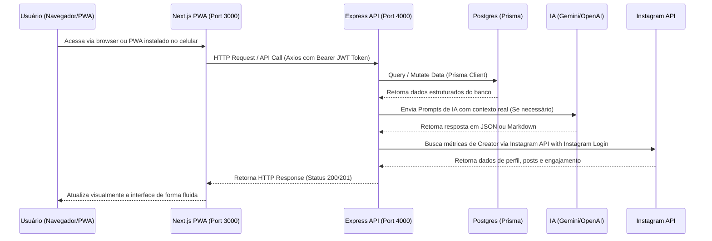

# ✦ Guia de Integração e Desenvolvimento do Desenvolvedor — InfluNext

Este guia descreve a arquitetura geral da **InfluNext**, detalhando as tecnologias (Stack), a estrutura de pastas de cada componente, o fluxo de comunicação entre as partes e os passos necessários para rodar e começar a codificar novos recursos.

---

## 🛠️ 1. Stack Tecnológica Geral

A InfluNext é dividida em **dois pilares** para maximizar velocidade de entrega e simplificar a manutenção:

### A. Backend API (Core)
*   **Runtime**: Node.js com **TypeScript**.
*   **Framework Web**: **Express** (Gerenciamento de rotas, middlewares de autenticação, CORS).
*   **Banco de Dados & ORM**: **PostgreSQL** orquestrado via **Prisma ORM**.
*   **Validação de Schemas**: **Zod** (Segurança contra payloads maliciosos em endpoints).
*   **Fila de Processamento**: **BullMQ** + **Redis** (Gerenciamento assíncrono de envio de notificações por email/push).
*   **Segurança**: **JWT** (Autenticação baseada em Tokens), **Bcrypt** (Criptografia de senhas) e **Otplib** (Segurança 2FA).
*   **Integração de IA**: SDK oficial do **Google Generative AI** (Gemini 1.5 Flash/Pro) e **OpenAI/OpenRouter** (GPT-4o).
*   **Cobranças/Assinaturas**: Integração nativa com **Stripe API** e Stripe Connect (Contas Express para custódia de Escrow).

### B. Frontend Web (PWA — Mobile-First)
*   **Framework**: **Next.js 16.2.4 (App Router)** com **React 19.2.4**.
*   **Aparência & Estilos**: **Tailwind CSS v4** (CSS-first engine de alta velocidade) + **shadcn/ui** + `@base-ui/react`.
*   **Gerenciamento de Estado & Formulários**: **React Hook Form** + **Zod** + Cookies de sessão.
*   **PWA**: `@ducanh2912/next-pwa` para suporte completo a Progressive Web App (instalação direta no mobile, caching offline, responsividade total sem necessidade de App Store ou Play Store).

---

> [!IMPORTANT]
> **Estratégia Mobile (Atualizado em Julho/2026)**
>
> O aplicativo Flutter WebView (`mobile-standby/`) foi **suspenso temporariamente**. A estratégia de entrega mobile é exclusivamente via **Next.js PWA responsivo**, que permite ao usuário instalar a plataforma diretamente do navegador (Safari/Chrome) como um aplicativo nativo sem burocracia de loja.
>
> **Regra de desenvolvimento:** Toda tela nova deve ser testada em resolução mobile (≤ 390px de largura) antes de ser integrada ao branch principal.

---

## 📁 2. Estrutura de Pastas e Caminhos Importantes

```
influnext-api-main/
├── docs/                       # Guias de IA, Segurança e Onboarding
│   ├── AI_SYSTEMS_GUIDE.md     # Personas, regras de negócio e prompts da IA
│   ├── ANTI_FRAUD_AND_SECURITY_POLICY.md # Política de integridade e prevenção à fraude
│   └── DEVELOPER_ONBOARDING_GUIDE.md  # Este arquivo

├── src/                        # API Backend (Node.js/TypeScript)
│   ├── controllers/            # Controladores (Validação de entrada com Zod e responses)
│   ├── middlewares/            # Autenticação de token JWT e permissões de roles
│   ├── routes/                 # Definição e agrupamento de rotas (auth, ai, etc.)
│   ├── services/               # Lógica e regras de negócio pura (IA, finanças, cálculo de scores)
│   └── server.ts               # Arquivo de entrada principal da API
├── prisma/                     # Esquemas e Scripts de Banco de Dados
│   ├── schema.prisma           # Definição do Modelo Relacional Postgres
│   └── seed.ts                 # Dados simulados para preencher o ambiente de desenvolvimento
├── web/                        # Frontend Next.js (React/Tailwind PWA)
│   ├── src/app/                # Estrutura do App Router (páginas, layouts e rotas do Next)
│   ├── src/components/         # Componentes React reutilizáveis de UI
│   └── public/                 # Ativos estáticos, manifest do PWA e ícones
└── mobile-standby/             # ⚠️ SUSPENSO — Aplicativo Flutter WebView (referência histórica)
```

---

## 🔄 3. Fluxo de Integração e Comunicação



---

## ⚡ 4. Guia Passo a Passo para Iniciar o Desenvolvimento

Para rodar todo o ambiente de desenvolvimento em sua máquina local, execute os passos abaixo. Certifique-se de ter o **Node.js (v18+)** e **Redis** instalados.

### Passo 1: Configurar a API Backend
1. Navegue até a pasta raiz:
   ```bash
   cd influnext-api-main
   ```
2. Instale as dependências da API:
   ```bash
   npm install
   ```
3. Duplique o arquivo `.env.production.example` para `.env` e configure suas chaves de ambiente:
   *   `DATABASE_URL`: URL de conexão do PostgreSQL.
   *   `GEMINI_API_KEY`: Chave da API do Google Gemini (para mentorias virtuais de criadores).
   *   `OPENAI_API_KEY`: Chave da API da OpenAI (para análises de marketing).
   *   `STRIPE_SECRET_KEY`: Chave secreta da Stripe (para pagamentos e custódia de escrow).
   *   `INSTAGRAM_CLIENT_ID` e `INSTAGRAM_CLIENT_SECRET`: Credenciais do App da Meta para Instagram API with Instagram Login.
4. Gere o cliente Prisma e rode os seeds no banco:
   ```bash
   npx prisma generate
   npm run seed
   ```
5. Inicie a API em modo de desenvolvimento (porta `4000`):
   ```bash
   npm run dev
   ```

### Passo 2: Configurar o Frontend Web (PWA)
1. Navegue até a pasta `web`:
   ```bash
   cd web
   ```
2. Instale as dependências do frontend:
   ```bash
   npm install
   ```
3. Crie um arquivo `.env.local` e configure a URL de conexão com a API:
   ```env
   NEXT_PUBLIC_API_URL=http://localhost:4000/v1
   ```
4. Inicie o servidor do Next.js (porta `3000`):
   ```bash
   npm run dev
   ```

---

## 🤝 5. Guia de Colaboração (Trabalho em Equipe via GitHub)

Para desenvolvimento em paralelo sem conflitos de merge, adotamos o seguinte modelo de branches:

```
main        ← Branch de produção (deploy automático no Vercel/Railway)
  │
staging     ← Branch de integração/homologação (todos os PRs vão aqui primeiro)
  │
feature/*   ← Branches individuais de cada funcionalidade
              Exemplo: feature/instagram-creator-oauth
              Exemplo: feature/escrow-7-percent-taxa
```

### Regras Obrigatórias de Pull Request (PR):
1.  **Nunca** fazer push diretamente na `main`.
2.  Toda feature ou correção deve ser desenvolvida em uma branch `feature/nome-descritivo`.
3.  Abrir um **Pull Request** da branch `feature/*` para `staging`.
4.  O outro desenvolvedor deve revisar e aprovar o PR antes do merge.
5.  Apenas `staging` é mergeada na `main` após validação completa em ambiente de homologação.

### Divisão de Escopo de Desenvolvimento:
*   **Desenvolvedor A (Backend/API/IA):** Foca em `src/`, `prisma/` e serviços de integração externa (Instagram, Stripe, IA).
*   **Desenvolvedor B (Frontend/UI/PWA):** Foca em `web/src/` — telas, componentes e chamadas Axios.

---

## 🚀 6. Como Desenvolver Mais Recursos

### Para Adicionar uma Nova Rota ou Funcionalidade na API:
1.  **Banco de Dados**: Se a funcionalidade exigir novos dados, modifique o [schema.prisma](file:///a:/influnext-api-main/influnext-api-main/prisma/schema.prisma) e execute `npx prisma db push` para atualizar o banco.
2.  **Service**: Crie ou edite a lógica em `src/services/` (ex: cálculos, integrações de APIs externas).
3.  **Controller**: Valide a entrada de dados do usuário usando **Zod** no controller correspondente em `src/controllers/`.
4.  **Route**: Registre o endpoint mapeando-o para as rotas em `src/routes/` e vincule-o ao middleware `authenticate` se exigir login do usuário.

### Para Desenvolver Telas no Frontend:
*   Use as rotas baseadas na estrutura do App Router (`web/src/app/`).
*   Construa componentes funcionais em React, estilizando-os com **Tailwind CSS v4** e utilizando os blocos do **shadcn/ui** já configurados.
*   Conecte as telas aos endpoints criados na API utilizando a biblioteca **Axios** instanciada nas requisições.
*   **Sempre** teste no DevTools do Chrome em modo mobile (390px de largura) para garantir que o layout seja responsivo e a experiência PWA seja perfeita.
