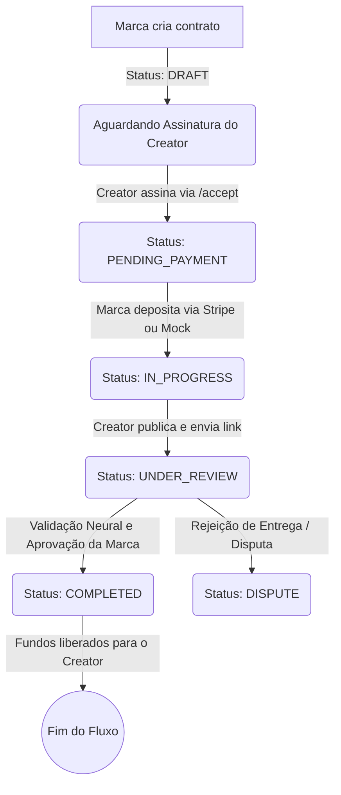

# Fluxo de Garantia Financeira (Escrow) e Ciclo de Vida do Contrato

Este documento descreve detalhadamente o fluxo de **Escrow (Garantia Financeira)** e o ciclo de vida dos contratos na plataforma **InfluNext**. O objetivo é garantir segurança jurídica para os influenciadores (Creators) e segurança financeira para as marcas (Companies), retendo os valores em custódia segura até que as entregas acordadas sejam validadas.

---

## 💡 O que é o Escrow no InfluNext?

O **Escrow** é um mecanismo de depósito de garantia. 
Quando uma marca fecha um contrato com um creator:
1. A marca realiza o pagamento correspondente ao orçamento do contrato.
2. Em vez de o dinheiro ir direto para a conta do creator, ele fica **bloqueado em custódia segura** pela plataforma.
3. O creator produz e publica os conteúdos.
4. A IA do InfluNext audita as métricas e links de publicação.
5. Após a validação e aprovação final da entrega, os fundos são liberados de forma segura diretamente para a carteira do creator.

Isso elimina o risco de inadimplência (para o creator) e o risco de não entrega ou entrega fora das especificações (para a marca).

---

## 📈 Etapas do Ciclo de Vida do Contrato

Abaixo estão detalhados os estados do contrato no banco de dados (`escrowStatus`) e as ações de cada participante.

### 1. Criação do Contrato (Rascunho)
* **Ação**: A marca acessa a busca de influenciadores, define o título da campanha, o briefing detalhado, o orçamento total (budget) e os entregáveis (deliverables) com seus respectivos prazos e formatos.
* **Status no Banco (`escrowStatus`)**: `DRAFT` (Rascunho).
* **Assinatura do Creator (`influencerSigned`)**: `false`.
* **Visualização na UI**:
  - **Empresa**: Exibe o status **"Aguardando Creator"** (botão de pagamento desabilitado).
  - **Creator**: Exibe o painel **"Proposta Pendente"** com a opção de assinar eletronicamente.

### 2. Aceite e Assinatura Eletrônica pelo Creator
* **Ação**: O creator abre o contrato expandido na sua central de governança, analisa o briefing e os prazos, e clica em **"Assinar e Aceitar Contrato"**.
* **Efeito**: A API do backend gera um hash SHA-256 de consentimento legal baseado nos entregáveis e valores, e registra o IP e timestamp da assinatura.
* **Status no Banco (`escrowStatus`)**: `PENDING_PAYMENT` (Aguardando Pagamento).
* **Assinatura do Creator (`influencerSigned`)**: `true`.
* **Visualização na UI**:
  - **Empresa**: O botão **"Depositar"** fica habilitado e ativo no painel principal e nos detalhes do contrato.
  - **Creator**: Exibe o status **"Aguardando Depósito"** (indicando que a marca precisa depositar para que a produção seja iniciada com segurança).

### 3. Depósito de Garantia (Escrow Ativo)
* **Ação**: A marca clica em **"Depositar"** para confirmar a provisão dos fundos. Ela pode seguir por dois caminhos:
  - **Real**: Checkout seguro processado pela Stripe (com cartão de crédito ou PIX) adicionando a taxa operacional da plataforma.
  - **Simulado (Mock)**: Ação instantânea de confirmação para fins de teste no ambiente de desenvolvimento local.
* **Status no Banco (`escrowStatus`)**: `IN_PROGRESS` (Em Andamento).
* **Visualização na UI**:
  - **Empresa**: Status **"Em Andamento"**. Ela consegue acompanhar a produção.
  - **Creator**: Recebe notificação instantânea avisando: *“Seu pagamento foi confirmado! Pode iniciar a produção.”* O entregável fica habilitado para envio de links de entrega.

### 4. Produção e Envio de Links (Revisão Neural)
* **Ação**: O creator produz os Reels, Stories ou vídeos no TikTok, posta nas redes sociais e envia a URL de publicação na plataforma.
* **Efeito**: O sistema valida estruturalmente o link por IA e muda o status da entrega.
* **Status no Banco (`escrowStatus`)**: `UNDER_REVIEW` (Em Análise).
* **Visualização na UI**:
  - **Empresa**: Recebe uma notificação de **"Ação Necessária"** no painel estratégico para revisar o conteúdo publicado.

### 5. Validação e Liberação do Pagamento (Conclusão)
* **Ação**: A empresa revisa o post, e clica em **"Liberar Pagamento"**.
* **Status no Banco (`escrowStatus`)**: `COMPLETED` (Concluído).
* **Efeito**: O valor líquido correspondente ao cachê acordado (descontadas as taxas dinâmicas da plataforma) é creditado instantaneamente ao saldo do influenciador para saque.

---

## 🛠️ Mapeamento de Endpoints Técnicos

Caso você precise inspecionar as rotas e controladores do projeto:

* **Criar Proposta**: `POST /v1/contracts` (Cria em `DRAFT`).
* **Assinar Proposta (Influencer)**: `POST /v1/contracts/:id/accept` (Muda para `PENDING_PAYMENT`).
* **Depositar / Confirmar Depósito (Empresa)**:
  - **Stripe Checkout**: `POST /v1/payments/create-order` (Gera URL do checkout Stripe).
  - **Manual/Mock**: `POST /v1/contracts/:id/pay` (Muda instantaneamente para `IN_PROGRESS` para testes rápidos).
* **Liberar Pagamento final (Empresa)**: `PATCH /v1/contracts/:id/release` (Muda para `COMPLETED` e libera o dinheiro).
