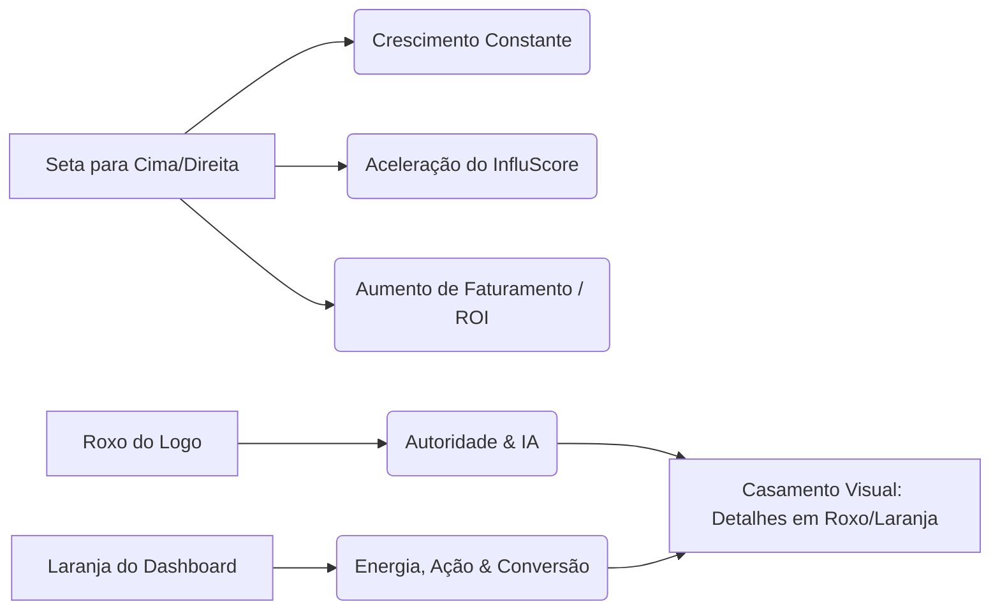

# 💡 Influnext - Brainstorm de Branding e Identidade Visual

Este documento apresenta um brainstorm de branding focado em integrar o novo logotipo da **Influnext** (com sua emblemática seta de crescimento e cores preto/roxo) com o layout do site e do dashboard (que utiliza a paleta **Branco e Laranja** no tema claro).

---

## 🎨 1. Conceito e Psicologia da Marca

O logotipo enviado apresenta a palavra **INFLUNEXT** com destaque roxo no **EX** e uma seta roxa apontando para cima e para a direita. 

### 🧠 Significado dos Elementos:
1.  **A Seta de Crescimento**: Simboliza a ascensão da carreira do influenciador e o aumento do engajamento e vendas das marcas. É um elemento altamente propício para animações de carregamento (loaders), transições e selos de verificação.
2.  **O Roxo (Logo) + O Laranja (Dashboard Web/PWA)**:
    *   **Roxo**: Transmite inovação, inteligência artificial (nosso assistente IA) e autoridade.
    *   **Laranja/Amber**: Transmite energia, proximidade, conversão e ações de alta prioridade (como os botões de "Sacar" e "Missões Diárias").
    *   **Diretriz**: O logotipo oficial permanece roxo e preto para transmitir exclusividade e sofisticação corporativa. No entanto, o ecossistema web/dashboard adota o **Branco e Laranja** no tema claro para manter a sensação de clareza, limpeza e energia diária.

---

## 📱 2. Aplicação Prática no Dashboard (Tema Clean)

A transição dinâmica para o **Tema Clean (Branco e Laranja)** traz as seguintes melhorias:

*   **Fundo Limpo**: Saímos do fundo azul escuro para um fundo branco/cinza claro suave (`bg-[#f8fafc]`), o que reduz consideravelmente a fadiga visual durante o uso prolongado e simula um painel administrativo corporativo moderno.
*   **Realces em Laranja**: O botão de "Sacar", as taxas de performance e os ícones de ação recebem tons de laranja vibrante (`orange-500` / `orange-600`), criando pontos de foco instantâneos na tela.
*   **Micro-animações**:
    *   **Efeito Hover nos Cards de Missões**: O card se eleva suavemente com uma leve sombra laranja e bordas suaves, transmitindo um feedback tátil premium.
    *   **Loader de Seta**: O ícone de carregamento pode usar a seta de crescimento do logo rotacionando ou subindo suavemente.

---

## 📢 3. Sugestões de Posicionamento para Redes Sociais

Para o Instagram e outras redes, a estética deve refletir essa dualidade de sofisticação (preto/roxo) e simplicidade de uso (branco/laranja):

### 📐 Grade de Cores das Postagens (Visual Grid)
*   **Posts Institucionais / Lançamento de Funcionalidades**: Fundos pretos com iluminação roxa e o logotipo em destaque (linha corporativa).
*   **Dicas Diárias / Depoimentos de Sucesso**: Estética limpa, fundos brancos, fontes minimalistas escuras e realces em laranja (linha Creator/Comunidade).

### 💡 Ideia de Gancho de Conteúdo (Reels/TikTok)
> *"Por que a seta do nosso logo importa? Porque ela representa o PIX garantido subindo e a sua pontuação de autoridade (InfluScore) decolando. Na Influnext, o crescimento não é uma promessa vazia, é auditado por IA e protegido por contrato."*

---

> [!TIP]
> Essa fusão garante que a Influnext seja percebida como uma ferramenta robusta de tecnologia e inteligência artificial (identidade escura e roxa), mas que também seja extremamente amigável, transparente e estimulante no uso cotidiano do painel financeiro (identidade clara e laranja).
